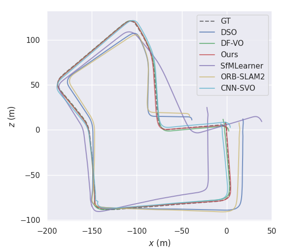

# Introduction

This repository contains a Python implementation of the JD-VO system (Joint Depth-Flow Visual Odometry), developed by Hu Qingyuan. 
It is based on the system described in **"Monocular Visual Odometry with Absolute Scale Recovery via Joint Depth-Flow Learning"**.


This repo includes
1. visual odometry system JD-VO;
2. evaluation scripts for JD-VO; 
3. visualize JD-VO results;
4. How to run JD-VO on self-collected dataset


### Contents
1. [Requirements](#1-requirements)
2. [Download KITTI dataset](#2-download-kitti-dataset)
3. [Download models](#3-download-models)
4. [Run JD-VO on kitti odometry dataset](#4-run-jd-vo-on-kitti-odometry-dataset)
5. [Result evaluation](#5-result-evaluation)
6. [Run JD-VO on self-collected dataset](#6-run-jd-vo-on-self-collected-dataset)


### 1. Requirements

This code was tested with Python 3.7, CUDA 11.6, Ubuntu 20.04, and [PyTorch-1.13](https://pytorch.org/).


```
conda create -n jd_vo python=3.7
conda activate jd_vo
```

### 2. Download KITTI dataset

We use the [KITTI Odometry Dataset](http://www.cvlibs.net/datasets/kitti/eval_odometry.php) for testing. After downloading the dataset, please convert the PNG images to JPEG using the command below. Note that this will also delete the original PNG files.
```
find kitti_data/ -name '*.png' | parallel 'convert -quality 92 -sampling-factor 2x2,1x1,1x1 {.}.png {.}.jpg && rm {}'
```

and then resize to 640×192.

### 3. Download models

You can download the depth, optical flow, and keypoint networks from [here](https://www.dropbox.com/scl/fo/8xo2xsb3gv6o5ysm6c3gn/AMfeHtUQB6FeVjTvZozmdNQ?rlkey=mb8s9jxe64vphmr4tztdkjkp5&st=4jwuh3lp&dl=0), and save them in the models/ folder.


### 4. Run JD-VO on KITTI odometry dataset

```
python apis/run.py -d options/examples/default_configuration.yml  
```

Results are stored in the directory defined by configuration file.
See `options/examples/default_configuration.yml`  for a reference configuration.


### 5. Result evaluation

The evaluation can be performed by executing the command shown below:

```
python tools/evaluation/odometry/eval_odom.py --result result/tmp/0 --align 6dof
```
Alternatively, trajectory evaluation can also be performed using [evo](https://github.com/MichaelGrupp/evo).


<div align="center">
  
  <p><b>Sequence 00</b></p>

  
  <p><b>Sequence 02</b></p>

  
  <p><b>Sequence 05</b></p>

  
  <p><b>Sequence 07</b></p>

  
  <p><b>Sequence 09</b></p>

  
  <p><b>Sequence 10</b></p>
</div>


### 6. Run JD-VO on self-collected dataset

To prepare your own dataset, the following steps are required:

1. Convert the images from PNG to JPEG format, and resize them to the target resolution.
2. Modify the camera intrinsic matrix accordingly to match the resized images. For convenience, you can directly replace the `calib.txt` files in the KITTI dataset with your updated calibration parameters.
3. Update the configuration `.yml` file to reflect the paths and parameters of the new dataset.
4. After completing the above steps, you can run the system with your own data.


### License
The code is released under the permissive MIT license.


### Related Projects

This repository incorporates and adapts components from several outstanding open-source projects:

- [DF-VO](https://github.com/Huangying-Zhan/DF-VO)  
- [monodepth2](https://github.com/nianticlabs/monodepth2)  
- [LiteFlowNet](https://github.com/twhui/LiteFlowNet)  
- [SuperPoint](https://github.com/rpautrat/SuperPoint)  
- [pytorch-liteflownet](https://github.com/sniklaus/pytorch-liteflownet)

The borrowed code is used in accordance with the original licenses of the respective projects.
